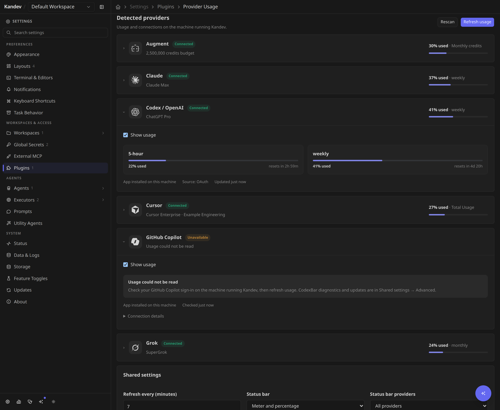
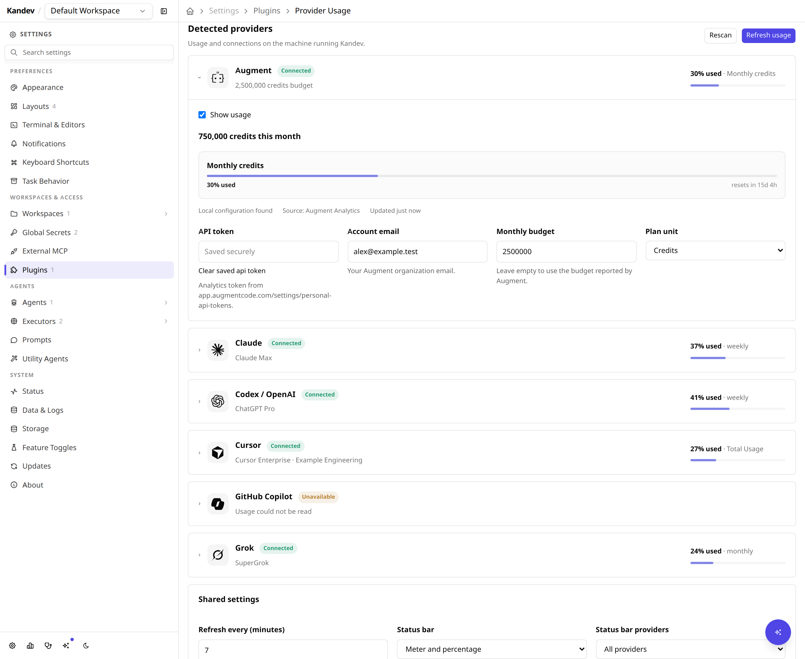
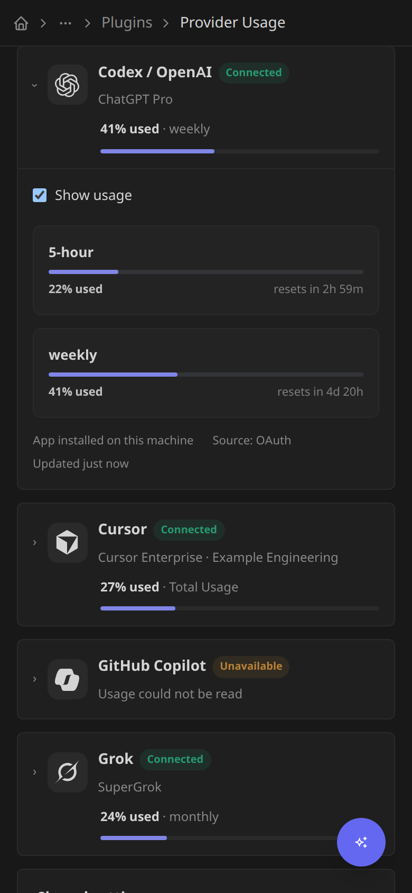
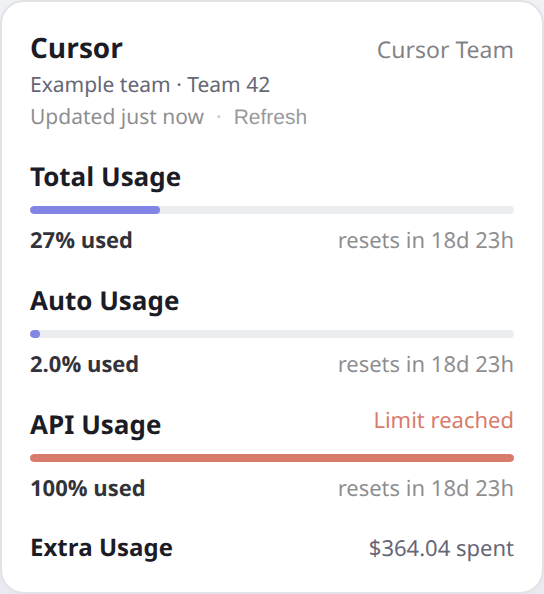

# kandev-provider-usage

A [kandev](https://github.com/kdlbs/kandev) plugin that shows **subscription
utilization** for your agent providers — how much of each rate-limit window
(5-hour / weekly / monthly …) is used, with reset times — in the shared page-wide
and session top bars and, when enabled, Kandev's global status bar. Data comes from the
[codexbar](https://github.com/steipete/codexbar) CLI (covers ~60 providers:
Claude, Codex/OpenAI, Gemini, Copilot, Cursor, Grok, OpenCode, …) plus
Augment's own Analytics API.

## Screenshots

**Settings → Plugins → Provider Usage** groups the providers detected on the
Kandev host. Each section shows its connection, plan or team, and percentage
used. Expand it for quota/reset details and its configuration controls.



<details>
<summary>Augment settings and phone layout</summary>

Augment keeps its API token, account email, budget and plan unit alongside
monthly consumption:



The same provider sections adapt to the phone layout:



</details>

These settings captures show version 0.8.2 installed in an isolated Kandev
instance, using synthetic accounts and usage. See the
[screenshot gallery and verification notes](docs/screenshots/README.md).

A pill in the shared page-wide top bar (`main-top-bar` slot) and session top
bar (`chat-top-bar` slot) shows the selected provider as an icon + %:


Hover it to open a panel that cycles through every provider. Click a tab to
select it; the pill updates immediately and that selection persists
across app/browser restarts. If it is unavailable, the panel falls back to the
current session's provider, then the first available provider.


Augment shows month-to-date consumption against a budget, plus average/day and
a projected month-end total:


## What it does

### MCP agent tool

The plugin exposes the read-only MCP tool
`kandev_kandev_provider_usage_get_provider_usage` on Kanban and Office task
surfaces. It returns the existing instance-wide, non-user-scoped background
snapshot; Kandev supplies the invocation workspace identity and callers cannot
select a workspace, account, session, or credential.

Calls never run codexbar or contact provider APIs. They return cached telemetry
with generation time, age, and a stale flag (at twice the configured polling
interval); before the first poll, the tool returns a well-formed partial
response. Availability values distinguish available, quota exhaustion, stale
telemetry, unavailable providers, missing configuration, unsupported providers,
and unknown errors. The structured result contains only normalized metadata and
never raw provider errors, account identifiers, or credentials.

Coordinators should poll no more frequently than the configured interval. Use
the UI Refresh action when a fresh provider read is needed.

- **Provider settings**: one section per detected provider, with connection
  status, plan/team and usage summaries, quota resets, source and freshness.
  Local discovery loads independently of remote usage, so slow providers do
  not block configuration. Pause each provider with **Show usage**, select a
  named Cursor team, or configure Augment in its own section.
- **Shared and session top bars (default)**: the same widget in `main-top-bar`
  (Home/Kanban, Tasks, and Threads) and the existing `chat-top-bar` plugin slot
  (kandev ≥ [#1827](https://github.com/kdlbs/kandev/pull/1827)) — a pill for
  your selected provider (icon + %), each real brand mark rendered monochrome.
  Hover to open a panel that cycles through every provider; click to switch,
  and the selected tab is remembered locally.
  The shared bar has no task or active session: it reads the same account-wide
  snapshots and uses the saved provider, then the first available provider.
  In a session, the current provider remains the fallback before the first
  available one. On phones, open the listing menu and tap the pill to expand
  usage inline; provider tabs and Refresh have 44 px minimum touch targets.
- **Global status display (opt-in)**: `display_status_bar_mode` chooses `off`
  (default), `percentage`, `meter`, or `both`. The contribution in
  `app-status-bar-right` renders the selected compact presentation plus reset
  context; hover opens the same full provider panel as the session top-bar
  pill. It adapts to the host's 24 px desktop/tablet bar and its phone Status
  drawer. It is global provider/account usage only; session IDs only help
  resolve `current`.
- Each provider's panel shows its rate-limit windows as thin bars (calm indigo
  normally, warming to amber/coral only when high — never a hard red), a
  reset countdown, plan/source badges, and codexbar's pace summary
  ("48% in reserve"). Copilot labels its primary window Premium interactions;
  when CodexBar omits pace but supplies its monthly reset, the plugin derives
  reserve or deficit against linear calendar-month consumption.
- **Cursor details**: Total, Auto and API usage show the percentage used, with
  bars that fill as usage increases, reset times and extra spend.
  The backend supplements CodexBar with Cursor's dashboard endpoints,
  including Enterprise request allowances and personal spending
  caps. Missing metrics say "Not reported"; a failed optional lookup keeps
  the available quota visible. Shared team spend is explicitly labelled.
  When Cursor reports only `overallSpendCents`, it is shown as Total spend
  rather than being mislabeled as on-demand Extra Usage. Token-based Enterprise
  teams also show total spend against the effective member limit as a usage bar,
  with reserve or deficit calculated from the team's reported billing cycle.
- **Codex manual resets**: the provider panel and phone Status drawer show
  available reset credits separately from the scheduled quota countdowns.
  A compact summary shows the available count and nearest expiry. Click, tap,
  or use the keyboard to expand the inventory, sorted soonest first, with
  calendar dates and exact local timestamps. Redeemed, expired, and
  unknown-status credits are excluded. Credits without an expiry show
  "Expiry not reported". Count-only reports stay count-only; Win-CodexBar
  supplies a summary and the next expiry.
  Missing reset data leaves the section hidden, while a reported zero is shown
  as zero. This is display-only; the plugin does not redeem credits.
- **Augment** is a special case: codexbar can't read it off macOS, so it's
  fetched directly from Augment's Analytics API. Shows month-to-date
  consumption as a used-of-budget bar (defaulting to a 2.5M-credit budget for
  credit plans so it always renders a bar), plus average-per-day and a
  projected month-end total.
- **A background poller** refreshes a single snapshot of every provider every
  few minutes (configurable); the pill and panel reuse it without running a
  provider command on every hover. The first usage request after startup can
  wait for the initial poll; settings remain usable while it runs. An explicit
  **Refresh** rebuilds the snapshot. Each refresh tries codexbar's fast `oauth`
  source first, falling back to the agent CLI only when needed.
- **Local sign-in**: OAuth providers reuse credentials on the machine running
  Kandev (`~/.claude`, `~/.codex`, …). Cursor can use its Desktop session,
  Cursor Agent CLI login, or a configured dashboard cookie; Augment uses an
  Analytics token.

## codexbar distribution

codexbar ships per-platform release binaries (no npm/npx). The plugin resolves
the CLI in this order:

1. the **codexbar command** you set in Settings (a path, e.g.
   `/usr/local/bin/codexbar`);
2. a `codexbar` binary on `PATH`;
3. otherwise it **downloads a pinned build once**, verifies it against a
   bundled SHA-256, and caches it under `~/.config/kandev-provider-usage`.
   Linux uses upstream's fully static musl builds so it does not depend on the
   host's glibc version. macOS uses the native builds.

Upstream codexbar publishes no Windows CLI. Windows instead downloads the CLI
from [Win-CodexBar](https://github.com/nesszer/Win-CodexBar), a third-party port
that publishes a compatible `codexbar-cli.exe`; it is pinned and SHA-256 verified
the same way, and versioned separately because that port cuts its own releases.
The CLI ZIP is currently unsigned, so the pinned checksum does not replace code
signing or the need to trust the release publisher.
Nothing has to be installed by hand on any platform.

To update a managed CLI:

1. Open **Settings → Plugins → Provider Usage**.
2. Expand **Shared settings → Advanced** and click **Update CodexBar**.
3. Wait for the version and success message to appear (up to two minutes).

This explicitly opts into the latest stable release from the platform's release
repository. The plugin verifies the archive against GitHub's SHA-256 asset digest
and checks `--version` before selecting it. The selected version persists across
plugin restarts; normal refreshes reuse it without checking GitHub. The original
pinned build remains the default until you update. Previous binaries stay on disk,
and a failed download, verification, startup check, or selection write keeps the
previous version selected. **Re-check** refreshes status and usage; it does not
upgrade the CLI.

For a CLI configured in settings or found on `PATH`, update it with its existing
installation method. The plugin does not replace externally managed binaries.

When that fails, **Shared settings → Advanced → Usage connection**
shows which of those three paths was tried, the raw
cause (including the failed command's first stderr line), and a hint naming the
fix — no outbound access to github.com, a checksum mismatch, an unwritable
cache directory, an unsupported platform, or a configured path that isn't
executable. The download is retried on every refresh, so a transient failure
clears itself on the next poll or on **re-check**.

## Settings

**Settings → Plugins → Provider Usage** shows one expandable section per detected
provider. Detection uses installed CLIs/apps, local credential files, configured
connections and successful usage scans. A failed speculative probe does not add
a section. Installed providers with an expired login remain visible with their
connection error. A local-only scan renders the configuration independently of
remote usage checks, including after a plugin restart. **Rescan** updates the
local provider list without running usage commands or discarding your edits;
**Refresh usage** checks provider usage in the background. Slow or unavailable
providers do not prevent editing and saving settings.

Collapsed sections show the connection status, plan, selected team when relevant,
and a summary of the highest overall quota with a bar that grows as usage rises.
Expanded sections show each reported quota and reset time, the data source and
freshness, plus setup guidance and expandable diagnostics for unavailable usage.
Each section retains its **Show usage** switch and provider controls. Cursor's
named team picker and session cookie live inside **Cursor**. Augment's token,
email, budget and plan unit live inside **Augment**, when detected or configured.
The remaining providers reuse their existing local sign-in. Paused connections
retain their section so they can be enabled again.

**Shared settings** holds the refresh interval and status-bar presentation.
Expand **Status bar providers** to select several named providers, the current
session, or all providers. With none selected, the current session is used.
Existing selections remain editable even when a provider is not detected.
Its **Advanced** disclosure contains usage color thresholds, the CLI path and
CodexBar maintenance. **Save settings** applies edited fields while preserving
other provider settings and masked credentials. **Discard changes** restores
the saved values. The team picker has its own **Save team** action.

Configuration keys (retained for compatibility with existing installations):

| Key                       | Meaning                                                                                                     |
| -------------------------- | ------------------------------------------------------------------------------------------------------------ |
| `augment_api_token`        | Augment Analytics service-account token (stored as a secret — masked in the UI). Enables the Augment card. Create one at [app.augmentcode.com/settings/personal-api-tokens](https://app.augmentcode.com/settings/personal-api-tokens). |
| `augment_email`             | Your Augment org email, used to filter Analytics to your usage.                                             |
| `augment_monthly_budget`    | Budget for the used-of-budget %. Empty = a per-user Analytics override, else a 2,500,000-credit default.   |
| `augment_resource`          | `credits` (default) or `usd` — which metric your Augment plan bills.                                        |
| `cursor_cookie_header`      | Optional Cursor dashboard Cookie request header, stored as a secret. Overrides automatic Desktop and Agent CLI authentication; must match the account shown by CodexBar. Useful for a remote Kandev host. |
| `cursor_agent_keychain`     | `off` (default) or `on`. On macOS, opt in to reading the access token saved by `agent login`; Keychain may ask once. Linux and Windows Agent auth files are read automatically. |
| `codexbar_command`          | Explicit codexbar command. Empty = auto-detect / auto-download.                                             |
| `codexbar_poll_minutes`     | Background refresh interval (default 5, minimum 1).                                                          |
| `codexbar_providers`        | Comma-separated provider ids to poll. Empty = curated local-credential set; `"all"` = full sweep (slower).  |
| `disabled_providers`        | Paused provider IDs, managed by each section's Show usage switch. Their usage stays out of every panel. |
| `display_pill_providers`    | Providers included in the optional global status display, comma-separated. Tokens: `current`, `all`, or explicit ids. Empty = current session's provider only. The top-bar pills instead follow the locally remembered tab selection. |
| `display_status_bar_mode`   | `off` (default) keeps usage in the top bars only. `percentage` adds icon + percentage to global status; `meter` adds icon + meter without percentage; `both` adds meter + percentage. Enabled modes also appear in the phone Status drawer. Requires a Kandev host with app-status-bar slots. |
| `display_threshold_warn`    | A window at/above this % turns amber (default 75).                                                            |
| `display_threshold_high`    | A window at/above this % turns red/coral (default 90).                                                        |

Saving settings restarts the plugin, so changes take effect immediately; the
panel also has a **Refresh** button for an on-demand update.

Expand **Shared settings → Advanced** to see whether CodexBar resolved, its
version and the binary in use. Each provider's section shows its own connection
status. The editor renders inline via the host's `plugin-settings` slot.

The manifest schema remains the validation and secret-masking contract. On
hosts that also render the generic schema form, a stylesheet scoped to this
plugin's detail page hides that fallback only after the custom editor loads.
The fallback stays available if configuration/discovery cannot load or the
editor unmounts. A usage-fetch failure leaves the custom controls usable. Config
saves use the host's authenticated config API and merge edits into a fresh
masked config; the plugin does not maintain a second credential store.

When codexbar isn't working the card explains why: `missing` when no binary
could be resolved (download blocked, unsupported platform, checksum mismatch),
`not working` when one was found but wouldn't run. Both show the raw error plus
the next step to take. The same reason also appears in the hover panel, so a
blank pill explains itself without a trip to Settings.

### Cursor setup and data



This panel preview uses synthetic data; a narrower allowance can be exhausted
while Total Usage remains available. See the
[phone view and capture notes](docs/screenshots/README.md#cursor-details).

Leave `codexbar_providers` empty (Cursor is included), or include `cursor` in
your allowlist. The Cursor panel always preserves the CLI's Total, Auto and API
windows when available. Its compact pill uses Total Usage; a narrower exhausted
API allowance is shown as "Limit reached" in the panel.

If you belong to multiple Cursor teams, expand **Cursor** in
Settings → Plugins → Provider Usage, choose a **Team** by name and click
**Save team**. **Reload teams** refreshes the list from your signed-in account.
Teams with the same name include their IDs to distinguish them. The panel
shows the selected team's name and ID. The plugin checks the session's team
memberships, requests that team's spending data, and selects your member row.
A failed team lookup reports an error; it never falls back to CodexBar's
unscoped quota or to the first team in the list.

With a team selected, included requests use that member's reported request
count and the selected team's per-seat allowance. Extra Usage shows your
spending and personal limit for that team. Auto/API quotas and reset dates are
included only when Cursor's summary identifies the same team; otherwise those
fields remain unreported. An unavailable allowance never becomes a 0% reading.
Choose **Account usage (automatic)** for the default account usage. Team changes
save separately and refresh usage immediately; other settings and credentials
are preserved. The choice survives restarts and plugin upgrades. Existing
`cursor_team_id` values are migrated automatically, without selecting the first
team in the list. A missing team stays visibly unavailable until you choose
another team or account usage.

Detailed data is fetched on the background poll and **Refresh**, then shared by
the top-bar panel, status-bar panel and phone Status drawer. Authentication is
resolved on the machine running the plugin, in this order:

1. **Cursor · Session cookie** in Kandev's plugin settings, if supplied.
2. Cursor's manual cookie in the resolved CodexBar configuration:
   `CODEXBAR_CONFIG`, an absolute `XDG_CONFIG_HOME/codexbar/config.json`,
   `~/.config/codexbar/config.json`, or the existing legacy
   `~/.codexbar/config.json`. An explicit `cookieSource: "off"` disables
   automatic details; an empty/invalid manual cookie does not select another
   account.
3. Cursor Agent CLI's explicit `CURSOR_AUTH_TOKEN`, when inherited by the
   plugin process.
4. Cursor Desktop's local `User/globalStorage/state.vscdb`: under
   `~/Library/Application Support/Cursor` on macOS, `$XDG_CONFIG_HOME/Cursor`
   (default `~/.config/Cursor`) on Linux, or `%APPDATA%\Cursor` on Windows.
5. The session saved by `agent login`: when **Cursor · Agent CLI Keychain** is
   enabled, the `cursor-access-token` item for account `cursor-user` in macOS
   login Keychain;
   `$XDG_CONFIG_HOME/cursor/auth.json` (default `~/.config/cursor/auth.json`)
   on Linux, or `%APPDATA%\Cursor\auth.json` on Windows. A macOS Agent
   configured with `AGENT_CLI_CREDENTIAL_STORE=file` uses
   `~/.cursor/auth.json`.

When both automatic local sessions are available, Desktop is tried first and
Agent CLI is retained as a fallback if that session is rejected. On macOS the
plugin leaves Keychain untouched until access is enabled in settings. It then
checks that the expected item exists without requesting its secret before the
read; macOS may ask the signed-in user to allow that read.

For a remote host, sign into `cursor.com` in your browser, open DevTools →
Network, select a dashboard request and copy its **Cookie** request header into
**Cursor · Session cookie**. Save and refresh. Existing CodexBar manual cookies
are reused, so no duplicate configuration is needed. Credentials stay in the
backend and are never sent to the plugin UI. The account identity is checked
before combining dashboard data with CodexBar's quota.

The plugin reads local Cursor sessions without modifying their database,
credential file or Keychain item, and it never reads the Agent CLI refresh
token. Keep Cursor Desktop or Agent CLI signed in; run `agent login` again or
renew a manually supplied cookie when it expires. A setup/authentication
problem appears beneath the available Cursor quota.

Cursor account types expose different fields. Enterprise request allowances
remain the Total Usage metric, with Auto/API percentages added separately when
reported. Personal on-demand spend takes precedence over a team aggregate,
including a reported personal zero. Shared allowances/spend are labelled as
team data. Dollar values from the dashboard are converted from cents once.

Sources: [OpenUsage's Cursor integration](https://github.com/robinebers/openusage/blob/main/docs/providers/cursor.md)
and [CodexBar's Cursor provider](https://github.com/steipete/CodexBar/blob/v0.45.2/docs/cursor.md).
The integration uses `/api/usage-summary`, `/api/usage`,
and `DashboardService/GetCurrentPeriodUsage`. Failed
optional endpoints do not discard working provider data.
Explicit team selection uses `/api/dashboard/teams`, `/api/dashboard/team`
and `/api/dashboard/get-team-spend`, following the
[Cursor Usage extension's team requests](https://github.com/YossiSaadi/cursor-usage-vscode-extension/blob/master/src/api.ts)
and the [per-seat quota mapping in cursor-usage-mcp](https://github.com/udah1/cursor-usage-mcp/blob/master/src/usage.ts).
It does not assume that the account summary or RPC accepts a team query parameter.

## Layout

- `manifest.yaml` — usage, discovery, team-selection and CLI-maintenance
  webhooks, the UI bundle, the `api_read: ["sessions"]` capability (to resolve
  the current session's agent → provider server-side), persistent plugin state
  for the selected Cursor team, and the validation/secret-masking schema.
- `server/` — Go backend half (`pluginsdk.Plugin`), spawned by kandev over the
  gRPC plugin contract. Runs a background poller that shells out to codexbar
  and supplements it with Cursor's dashboard and Augment's Analytics API.
  Usage webhooks share the cached snapshot; discovery scans local connections
  without waiting for that poll.
- `ui/bundle.js` — hand-written, no-build ES module using the shared host React
  instance and `host.ui` components, plus inlined real brand-mark SVGs
  (monochrome). It registers shared and compatibility chat top-bar, plugin
  settings, and opt-in global status-right components, and only renders backend payloads.

## Develop

Requires a sibling checkout of the kandev monorepo at `../kandev` (see the
`replace` directive in `go.mod`).

```sh
make test           # Go + UI-bundle tests (codexbar/Augment calls are injected — no network needed)
make vet
go test -race ./server/...
make package-host   # tarball for this machine only (fast iteration)
make package        # tarball for all 5 supported platforms, including Apple Silicon
```

Install the tarball via **Settings → Plugins → Install plugin → Upload**.
For filesystem sideloading, copy the archive directly into the running host's
`$KANDEV_HOME_DIR/plugins` directory (normally `~/.kandev/plugins`), then click
**Settings → Plugins → Sync** in your authenticated browser. Merely copying
the archive or restarting Kandev does not activate it. Use an archive containing
the target platform's binary; `make package-host` on Linux cannot run on a Mac.

The equivalent HTTP install, when the instance's authentication is disabled, is:

```sh
curl -F package=@kandev-provider-usage-0.9.3.tar.gz \
  http://localhost:8080/api/plugins/install
```

Authenticated instances require a valid Kandev session or personal access token
for this endpoint; the signed-in Upload/Sync flow supplies that authentication.
Keep the installed version's directory and config intact when upgrading so
the host can preserve credentials and the selected Cursor team.

## Release

In **Actions → release**, run the workflow from `main` and choose a
patch, minor, or major bump. It commits the version update and generated
`CHANGELOG.md` directly to `main`, tags that commit as `vX.Y.Z`, then verifies
(`fmt`/`vet`/`test`), cross-compiles all platforms, and publishes the tarball +
`checksums.txt` as a GitHub Release, which the kandev marketplace resolves.
