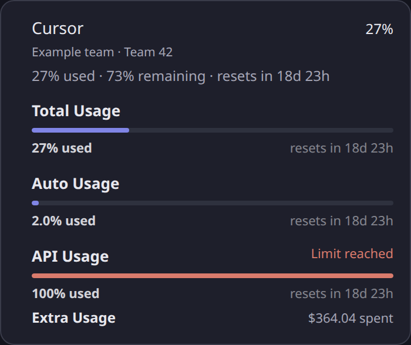

# Provider usage screenshots

## Current gallery

The installed 0.8.2 UI below uses synthetic provider accounts and usage.
The desktop overview expands Codex quotas and Copilot's connection guidance;
collapsed sections still show the plan, selected team and percentage used.

Augment's section retains the token, email, monthly budget and plan unit beside
its consumption and reset time:

The phone layout stacks quota windows and keeps summaries readable:

Current setup instructions are in the [README](../../README.md#settings).
The following notes distinguish installed-host captures from isolated component
previews and preserve the validation context for earlier screenshots.

## Richer provider settings (0.8.2)

Captured on September 15, 2026 from a disposable Linux amd64 Kandev
`v0.93.0-356-g6c5ab1598` instance with its own database, plugin directory,
configuration and loopback port. Version 0.8.2 was installed through Upload.
These screenshots use the packaged UI, real plugin process and native host
components:

- `installed-provider-settings-rich-desktop.png`: compact plan/team and usage
  summaries, expanded quotas with resets, and Copilot connection guidance.
- `installed-provider-settings-rich-mobile.png`: the same settings at phone width.
- `installed-provider-settings-rich-augment.png`: Augment's consumption, quota,
  saved credentials, email, budget and plan unit in the light theme.

Six synthetic providers exercise local discovery, usage and unavailable states.
Provider CLI output and the local Cursor/Augment HTTPS fixtures are synthetic;
browser API responses are not mocked. A file gate deliberately held the Copilot
subprocess while the installed settings page opened, rescanned local providers,
and saved configuration. In this local check, controls became ready in 170 ms
and saving completed in 93 ms without releasing the gate. Those timings are
fixture measurements, not live-provider performance claims. Saving cancels the
page's pending usage request before the host restarts the plugin.

Browser assertions verified local rescan preserves drafts, saves preserve both
masked credentials and Cursor team `30677937`, Augment fields survive restart,
quotas/reset/source details render, and raw connection errors stay behind a
disclosure. Desktop dark/light (1440 × 1180) and phone dark (390 × 844) were
captured at 2× scale without browser errors; the phone has no horizontal overflow.
The disposable instance was stopped after capture. Live account access and
native macOS execution were not exercised.

## Earlier installed provider settings (0.8.1)

Captured on September 15, 2026 from a disposable Kandev
`v0.93.0-356-g6c5ab1598` instance on Linux amd64. The host binary and web
assets were an existing local production build. The instance used its own
database, plugin directory, configuration and loopback port.

`make package-host` produced `kandev-provider-usage-0.8.1.tar.gz`, which was
installed through Settings > Plugins > Upload. These captures show that
installed package's real plugin process, native UI slot and host components:

- `installed-provider-settings-desktop.png`: detected providers and shared settings.
- `installed-cursor-settings-desktop.png`: Cursor expanded with its saved named team.
- `installed-provider-settings-mobile.png`: provider sections on a phone.
- `installed-cursor-settings-mobile.png`: Cursor's team and session controls on a phone.

The sample CodexBar executable reported Claude, Codex, Cursor and GitHub Copilot.
Cursor HTTPS responses came from a local fixture proxy trusted only by the test
process. Teams were Example Product (`30677936`) and Example Engineering
(`30677937`), with different usage values to verify selection. All provider
usage, account details and credentials were synthetic. Browser API requests,
the host configuration store and plugin state were exercised without browser
response mocks or replacing the plugin bundle.

Browser checks passed for upload/activation, four detected-provider sections,
the generic form hiding when the editor is ready, both named team selections
returning their own usage, configuration persistence after plugin restart and
page reload, masking a saved secret, preserving the team across settings saves,
pausing and re-enabling Copilot, retaining drafts during rescans, and discarding
drafts. Chromium captured desktop at 1440 × 1240 and phone at 390 × 844,
both at 2× scale, without page errors or horizontal overflow. The disposable
instance was stopped after capture. macOS execution and live account access
were not exercised by this verification.

### Augment settings

The first sample instance omitted Augment. A follow-up capture used the same
installed package and added a sample `auggie` executable to exercise detection.
`installed-augment-settings-desktop.png` and
`installed-augment-settings-mobile.png` show its existing API token, account
email, monthly budget and plan unit controls on desktop and phone.

The local fixture proxy also served synthetic Augment Analytics responses.
Browser checks verified saving all four fields across plugin restarts, masking
the token, switching credits/USD and their respective budgets, and preserving
Cursor's cookie and selected team. After removing the sample `auggie`, Augment's
section remained visible through its saved configuration. Both captures passed
without page errors or horizontal overflow. This required no plugin code or
package changes; the disposable instance was stopped again after verification.

## Earlier provider settings component previews

Captured on September 15, 2026 with synthetic providers, team names and IDs.
`provider-settings-light.png` and `provider-settings-mobile.png` show the
detected-provider sections and shared configuration at 900px and 390px.
`cursor-settings-light.png` and `cursor-settings-mobile.png` show Cursor
expanded, including its team picker, usage switch and saved session cookie.
The unmodified plugin bundle was rendered with React in Strict Mode, fixture
webhook responses, and host-like cards and theme CSS. These isolate the plugin's
settings component. The fixture includes the host's detail-page and generic-form
selectors to verify that the generic fallback hides only while this editor is
ready and is restored on unmount; it is not an installed host capture.

Chromium checks covered provider grouping, preserving the saved team, switching
teams, failed saves, preserving drafts through rescans, merging configuration
edits without losing other values or masked secrets, discarding drafts, and
opening shared maintenance controls. Desktop light and phone light/dark themes
passed without horizontal overflow or browser errors.

## Cursor details

Refreshed on September 15, 2026 using synthetic fixtures, not a live Cursor account.
`cursor-details-light.png` shows the selected team, Total/Auto/API percentage
used and extra spend;
`cursor-details-mobile.png` shows the same details in the phone Status row.

The unmodified UI bundle's `providerPanel` and `statusMeterDrawerRow` renderers
were loaded in Chromium with a DOM JSX adapter and host-like theme/utility CSS.
This isolates the plugin components; it is not an installed Kandev host capture.
The example team, 27% total / 2% Auto / 100% API usage and $364.04 spend are fixtures used to
exercise the requested presentation. The account name,
dates and values do not represent the user's Enterprise account.

Browser checks covered light/dark panels, bar widths matching percentage used,
the phone Status row, no horizontal overflow at 390px, and no browser errors.
Desktop captures used a 700 × 850 viewport; the phone
capture used 390 × 844. Both were captured at 2× scale.

## Codex manual resets

Captured on September 9, 2026 for PR #22 using an authenticated Codex account.

The production Go runner, collector, and overview webhook were exercised with
CodexBar CLI 0.45.2 (`oauth` source). The response contained three available
manual reset credits, expiring on September 21, October 4, and October 5, 2026.
No reset credits were redeemed.

The screenshots show this PR's unmodified UI bundle loaded through Kandev's
actual plugin host. Playwright replayed the normalized live webhook response in
the browser; this was not a packaged-plugin installation. The existing Kandev
instance's plugin configuration and settings were left unchanged.

- `codex-manual-resets-light.png`: collapsed desktop summary, light theme.
- `codex-manual-resets-dark.png`: collapsed desktop summary, dark theme.
- `codex-manual-resets-mobile.png`: collapsed provider row in the phone Status drawer.
- `codex-manual-resets-light-expanded.png`: expanded desktop inventory, light theme.
- `codex-manual-resets-dark-expanded.png`: expanded desktop inventory, dark theme.
- `codex-manual-resets-mobile-expanded.png`: expanded reset details after scrolling
  the phone Status drawer so every expiry is visible.

Chromium used a 1440 × 1000 desktop viewport and a 390 × 844 touch viewport,
both at 2× device scale. Captures are cropped to the relevant panel or row.
Browser assertions checked the three-credit count and nearest expiry while
collapsed; every exact local timestamp and ascending expiry order when expanded;
and absence of horizontal overflow in both states. Enter and Space opened and
closed the desktop disclosure; tapping did the same on the phone. The summary
has a 44 px tap target. The phone provider icon stays aligned with its name, and
the expanded inventory is reachable through the drawer's normal scrolling.
All assertions passed without browser errors. Credentials, account identifiers,
and raw CodexBar output are not included.
